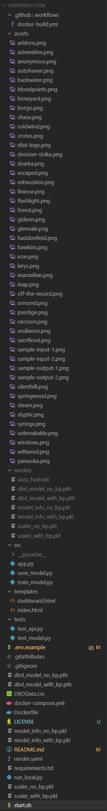
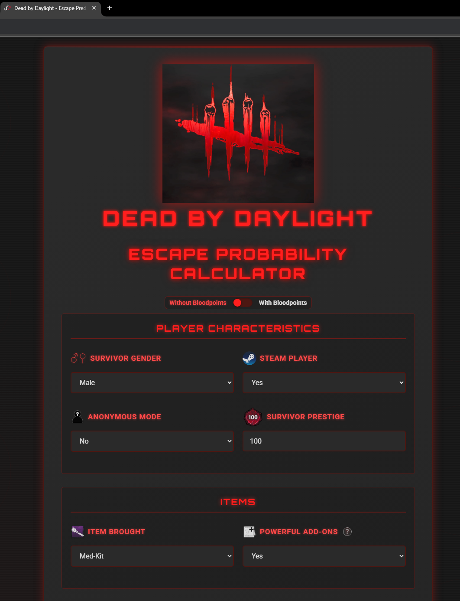
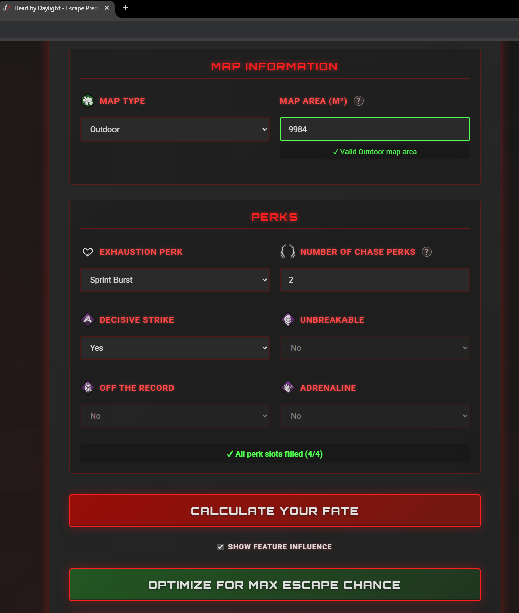
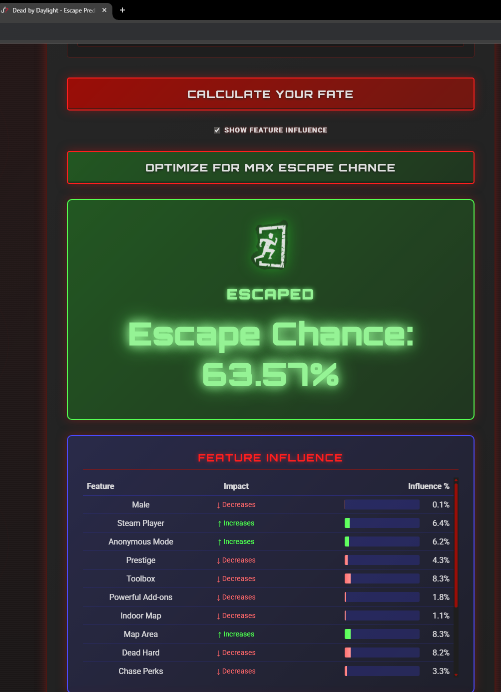
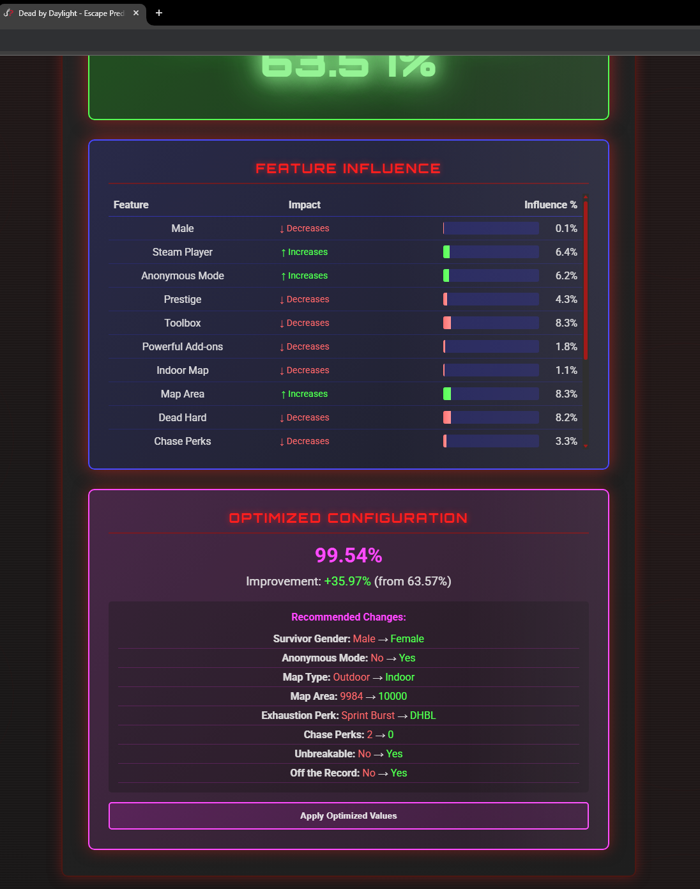

# Dead by Daylight Escape Prediction

## 1) Executive Summary

### Problem

Dead by Daylight (DBD) players, especially ones like myself who have dedicated thousands of hours to the game, want to understand a survivor's chance of escaping a match based on various in-game factors. Currently, I basically just have to rely on intuition and my personal experience to estimate escape probability. I can also sometimes look at a survivor's hour count in-game, but this is not always available as it is entirely up to the player to make this public or not. This project addresses the need for a data-driven prediction tool that helps potentially make more informed decisions during pre-game lobby queue and understand how certain factors (survivor characteristics, map size, items, prestige level, etc.) may or may not influence escape rates.

**Target Users**: Dead by Daylight players, gaming analysts, and researchers interested in game mechanics analysis

### Solution

This project is a machine learning web application that predicts a survivor's probability of escaping in Dead by Daylight using a PyTorch 2-layer neural network. The system takes inputs such as survivor characteristics, prestige level, items and add-ons, map information, perks (exhaustion, chase, and other perks), and player statistics (bloodpoints), then outputs a probability between 0-100%, indicating the likelihood of escape or sacrifice. The application is delivered as a Flask web app with a user-friendly, categorized interface deployed through Docker, and made available on the Render cloud service, making it accessible to both technical and non-technical users. The model automatically trains on startup using the provided CSV data, ensuring it's always up-to-date with the latest gameplay patterns.

## 2) System Overview

### Course Concept(s)

- **Flask API**: Putting my neural network model into a Flask app for deployment into an html file to be interactive for the user
- **Containerization**: Docker for consistent deployment and environment management
- **Cloud Services**: Deployed the entire project to Render to be constantly available (with the exception of startup time after periods of inactivity)

### Architecture Diagram

The system follows a request-response flow with multiple endpoints:

**Prediction Flow:**
1. User submits form data via web interface
2. Flask receives and validates input (including perk count validation)
3. Features are preprocessed and scaled
4. PyTorch model performs inference
5. Result (escape probability) is returned and displayed
6. Optionally, feature importance is calculated and displayed if option is selected

**Optimization Flow:**
1. User clicks "Optimize" button with current form values
2. Flask receives current configuration
3. Optimization algorithm searches for best variable combinations (respecting 4-perk limit)
4. Optimal configuration is returned with escape chance improvement and suggested changes
5. User can apply optimized values to the form

**Feature Importance Flow:**
1. User checks "Show feature influence" and submits prediction
2. Flask calculates gradients using backpropagation
3. Feature importance (magnitude and direction) is computed
4. Results are displayed showing which features increase/decrease escape chance

**System Flow:**
1. User inputs game parameters via web interface or API (locally)
2. Flask application receives and validates input (perk count, data types, ranges, etc.)
3. Features are preprocessed and scaled using saved scaler
4. PyTorch model performs prediction
5. Optional: Feature importance calculated via gradient analysis as explained above
6. Result is formatted as probability percentage and returned to user
7. Optional: Optimization endpoint finds best configuration to maximize escape chance as explained above

### Image/Screenshot Diagram



### Text Diagram

```
DBDPrediction/
├── src/                    # Application source code
│   ├── app.py             # Flask web application
│   ├── train_model.py     # Model training script (trains both models)
│   └── save_model.py      # Model saving utility
├── tests/                  # Unit and smoke tests
│   ├── test_api.py        # API endpoint tests
│   └── test_model.py      # Model architecture tests
├── templates/              # HTML templates
│   └── index.html         # Main web interface (includes model toggle switch)
├── assets/                 # Images and static assets
│   ├── dbd-logo.png       # Dead by Daylight logo
│   ├── icon.png           # Favicon
│   ├── escaped.png        # Escape outcome image
│   ├── sacrificed.png     # Sacrifice outcome image
│   ├── *.png              # Various UI icons (steam, prestige, perks, etc.)
├── models/                 # Model files directory (created at runtime)
│   ├── dbd_model_with_bp.pth
│   ├── dbd_model_no_bp.pth
│   ├── scaler_with_bp.pkl
│   ├── scaler_no_bp.pkl
│   ├── model_info_with_bp.pkl
│   ├── model_info_no_bp.pkl
│   └── data_hash.txt      # Hash of training data (for change detection)
├── DBDData.csv            # Training data (included in image, not repo)
├── Dockerfile             # Docker image definition
├── docker-compose.yml     # Docker Compose configuration
├── render.yaml           # Render cloud deployment configuration
├── requirements.txt       # Python dependencies
├── run_local.py          # Local development runner (sets up paths, runs Flask)
├── start.sh              # Container start script (trains models, starts app)
├── README.md             # Project documentation
└── LICENSE               # License and attribution for game assets and external resources
```

**Generated Model Files** (created at runtime, not in repo):
- `dbd_model_with_bp.pth` - PyTorch model weights (with bloodpoints)
- `dbd_model_no_bp.pth` - PyTorch model weights (without bloodpoints)
- `scaler_with_bp.pkl` - Feature scaler (with bloodpoints)
- `scaler_no_bp.pkl` - Feature scaler (without bloodpoints)
- `model_info_with_bp.pkl` - Model metadata (with bloodpoints)
- `model_info_no_bp.pkl` - Model metadata (without bloodpoints)
- `data_hash.txt` - Hash of training data (for detecting changes in data)

**Model File Locations**:
- **Local development**: Models are saved to project root (`.`) or `models/` directory
- **Docker build**: Models are trained to `/app/` during image build
- **Docker Compose**: Models are persisted to `./models/` directory (mounted to `/app/models` in container)
- **Render deployment**: Models are pre-trained in image at `/app/` and used directly to not waste time as resources are much more limited on Render
- **Note**: The application checks multiple locations (`MODEL_OUTPUT_DIR`, current directory, project root, `/app/models`, `/app`) to find model files

### Data/Models/Services

**Training Data:**
- **Source**: `DBDData.csv` (gameplay data)
- **Size**: Varies by dataset (typically thousands of gameplay records)
- **Format**: CSV with columns for survivor attributes, game settings, and outcomes
- **License**: Project-specific data (not publicly distributed)

**Model:**
- **Type**: PyTorch Neural Network (2 hidden layers, batch normalization, dropout)
- **Dual Models**: Two models are trained and available:
  - **With Bloodpoints**: Includes survivor BP and killer BP as features (31 total features)
  - **Without Bloodpoints**: Excludes bloodpoint features (29 total features)
- **Input Features** (With BP model):
  - Player characteristics (gender, steam player, anonymous mode, prestige)
  - Items and equipment (item type, powerful add-ons)
  - Map information (map type, map area)
  - Perks (exhaustion perks, chase perks count, decisive strike, unbreakable, off the record, adrenaline)
  - Match Bloodpoints (survivor BP, killer BP)
- **Input Features** (Without BP model): Same as above, excluding bloodpoint features
- **Output**: Binary classification probability (escape vs. sacrifice)
- **Training**: Automatically trains both models on container startup with early stopping (max 100 epochs, patience 5), skips this step if data has not been updated (csv hash matches)
- **Format**: Saved as `dbd_model_with_bp.pth` / `dbd_model_no_bp.pth` (PyTorch state dict), `scaler_with_bp.pkl` / `scaler_no_bp.pkl` (scikit-learn StandardScaler), `model_info_with_bp.pkl` / `model_info_no_bp.pkl` (architecture metadata)
- **Size**: Model weights ~few MB each, total artifacts ~20-100 MB

**Services:**
- **Web Interface**: Flask web server (port 5000, configurable via `FLASK_PORT` env var) with toggle switch to select between models
- **Cloud Web Hosting**: Render web app service (Free tier, 512MB RAM) - deployed at https://dbd-calculator.onrender.com/
- **Container Registry**: Docker Hub (image: `h2x0/dbd-predictor:latest`) for pre-built images with trained models
- **API Endpoints**:
  - **GET `/`**: Main web interface (prediction form)
  - **GET `/dashboard`**: Analytics dashboard page with visualizations and statistics graphs
  - **POST `/predict`**: Main prediction endpoint (includes optional `include_importance` flag for feature influence)
  - **POST `/optimize`**: Optimization endpoint to find best variable configuration (respects 4-perk limit)
  - **POST `/top_builds`**: Returns top N builds with highest escape chances (accepts `model_type` and `count` parameters)
  - **GET `/statistics`**: Returns statistics about the training data including feature distributions and escape rates for displaying graphs
  - **GET `/health`**: Health check for container monitoring
- **Features**:
  - Real-time escape probability prediction
  - Feature importance analysis 
  - Configuration optimization
  - Perk validation (enforces 4-perk limit for survivors)
  - Dual model support (with/without bloodpoints), toggle for each on interface near the top

## 3) How to Run (Local)

### **Important Note**: First-time setup can take 20+ minutes due to model training. Please be patient.

### Quick Start (Recommended)

**Docker Compose** (easiest method):

```bash
# One command to build and start
docker-compose up -d

# View logs
docker-compose logs -f

# Access at http://localhost:5000

# Stop the container
docker-compose down

# Rebuild after code changes
docker-compose down
docker-compose build
docker-compose up -d
```

**Local Python** (no Docker required):

```bash
# Install dependencies
pip install -r requirements.txt

# Run (automatically trains models if needed, then starts server)
chmod +x start.sh && ./start.sh
```

### Alternative Methods

**Docker (manual):**

```bash
# Build
docker build -t dbd-predictor:latest .

# Run
docker run --rm -p 5000:5000 \
  -v $(pwd)/DBDData.csv:/app/DBDData.csv:ro \
  dbd-predictor:latest

# Health check (in another terminal)
curl http://localhost:5000/health
```

**Docker Hub (pre-built image):**

```bash
docker pull h2x0/dbd-predictor:latest
docker run --rm -p 5000:5000 h2x0/dbd-predictor:latest
```

**Prerequisites:**
- Docker/Docker Compose OR Python 3.8+
- `DBDData.csv` file in project root (for training)

**Note**: Models are automatically trained on first run. The `start.sh` script and Docker containers handle this automatically. Models are saved to `./models/` directory to avoid retraining on every restart.

### Cloud Deployment (Render)

Deploy using the included `render.yaml` configuration:

1. **Create Web Service in Render dashboard:**
   - Runtime: Docker
   - Docker image: `h2x0/dbd-predictor:latest`
   - Set `SKIP_TRAINING=true` (models are pre-trained in image)
   - See `render.yaml` for full configuration

2. **Update models with new data:**
   ```bash
   # Rebuild and push updated image
   docker build -t h2x0/dbd-predictor:latest .
   docker push h2x0/dbd-predictor:latest
   # Then trigger redeploy in Render dashboard
   ```

**Note**: Models are pre-trained during Docker build for fast startup (~30-60 seconds). The `DBDData.csv` file is included in the Docker image.

## 4) Design Decisions

### Why This Concept?

**Docker**: Essential for ensuring consistent deployment across different environments. My container includes all dependencies (PyTorch, Flask, scikit-learn, etc.) and gets rid of the "works on my machine" issues. **Models are pre-trained during Docker build** for fast startup times, and the container automatically checks if the data file has changed at runtime, only retraining when necessary. This provides the best of both worlds: fast startup (30-60 seconds) and automatic model updates when data changes.

**Flask**: The application only needs basic routing and JSON handling, making Flask appropriate for handling this front-end task. The REST API design allows for both web interface and programmatic access. It allows me to create a nice UI and UX for the project that has a coherent theme/scheme while being pretty easily usable.

**Cloud Services**: I wanted to make my project available outside of just locally running it on Docker Desktop. I looked at a few services like AWS and Google, but I found Render to be very straightforward and it directly takes a docker hub file as an input, so it made setup much easier since I already had created and pushed the docker hub image.

### Tradeoffs

**Performance vs. Model Size/Cost**: 
- **Decision**: CPU-only PyTorch for smaller image size and faster builds, free tier of Render to host cloud webpage
- **Tradeoff**: Smaller image size and faster builds, but no GPU acceleration. Also makes loading web interface in the cloud take long time, especially because of use of free tier of Render
- **Impact**: Build times are a bit slower, and inference is fast enough for web use (~5-10 ms per prediction) once it's up and running

**Dual Model Approach**:
- **Decision**: Train two separate models (with/without bloodpoints) to allow users to choose
- **Tradeoff**: Doubles training time and storage, but provides flexibility
- **Rationale**: Bloodpoints may be overly influential on predictions; users can choose based on their preference

**Complexity vs. Maintainability**:
- **Decision**: Custom neural network architecture vs. simpler models
- **Tradeoff**: More complex model requires careful architecture matching between training and inference
- **Mitigation**: Model metadata (`model_info.pkl`) stores architecture parameters to ensure compatibility

**Development vs. Production**:
- **Decision**: Pre-trained models in Docker image for production (Render), automatic retraining for local development
- **Tradeoff**: Pre-trained models enable fast startup in production (~30-60 seconds), while local containers can still retrain when data changes
- **Rationale**: Best of both worlds - fast production deployments and flexible local development
- **Implementation**: Models are trained during Docker build, and `SKIP_TRAINING` environment variable controls runtime behavior
- **Early Stopping**: Implemented to prevent overfitting and improve generalization as dataset grows (max 100 epochs, patience 5)

### Security/Privacy

**Secrets Management**: 
- No API keys or sensitive credentials required, so not really an issue
- Model files contain no user data (pre-trained weights only)
- Environment variables used for configuration (FLASK_HOST, FLASK_PORT, FLASK_DEBUG)

**Input Validation**:
- Flask automatically handles JSON parsing errors
- Input ranges validated on frontend (e.g., prestige 0-100)
- Type checking in prediction endpoint (float conversion with error handling)
- **Known Limitation**: No explicit rate limiting (acceptable for single-user/local deployment), difficult to implement on a base level sometimes

**PII Handling**:
- No personally identifiable information collected or stored
- All inputs are game statistics (gender, items, points) - no real names or identifiers
- Usernames are not inputted into data files. They are present in my personal screenshots of the data, but these are not posted in the data or repository anywhere
- No user session tracking or logging of predictions

**Data Privacy**:
- Optionally exclude training data (`DBDData.csv`) from repository via `.gitignore` (not entirely necessary at this moment, so I just kept it)
- Model/weight files (.pkl) excluded to prevent accidental data leakage of models and such (again, not really a huge deal, but it retrains these on run anyway, so no reason to keep them)

### Operations & Risk Management

**Operational Risks**:
1. **Model Training Failures**: If training fails on startup, container will not serve requests
   - **Mitigation**: Health check endpoint reports model status; container will fail health checks if models aren't loaded
   - **Recovery**: Manual container restart or redeployment
2. **Resource Exhaustion**: Model training on startup consumes significant CPU/memory
   - **Mitigation**: Health check start period set to 300s (5 minutes) to allow training time
   - **Risk**: On resource-constrained systems (Render free tier with 512MB RAM), training may fail or timeout, but I check in on the logs every so often just in case
3. **Data Availability**: Missing or corrupted `DBDData.csv` will cause training to fail
   - **Mitigation**: CSV file included in Docker image; can be overridden via volume mount
4. **Single Point of Failure**: Single-container deployment has no redundancy
   - **Mitigation**: Stateless design allows easy redeployment; no data loss risk
5. **No Backup/Recovery**: Model files are generated at runtime and not persisted
   - **Impact**: Container restart triggers retraining (intentional design for fresh models)

**Monitoring & Observability**:
- **Health Checks**: `/health` endpoint reports model loading status for both models
- **Logging**: Flask development server logs all requests and Render has log files available for monitoring while it's running (which I mentioned I personally check occasionally)
- **Limitations**: 
  - No structured logging (JSON format)
  - No metrics collection (request rates, latency, error rates)
  - No alerting mechanisms
  - No distributed tracing
- **Future Improvements**: Could add Prometheus metrics, structured logging (JSON), and error tracking (Sentry)

**Scaling Considerations**:
- Current design: Single-container deployment
- **Limitation**: No horizontal scaling capability (would require load balancer, shared state)
- **Future**: Could add Redis for session management, gunicorn for multi-worker support

**Known Limitations**:
1. Models are pre-trained during Docker build - to update models with new data, rebuild the image and redeploy
2. No database persistence (stateless predictions only)
3. Single-threaded Flask server (not suited for high traffic)
4. No authentication/authorization (suitable for local use mainly)
5. Training data can be provided via volume mount (`DBDData.csv`) or is included in Docker Hub image
**Note**: Local Docker containers will automatically retrain if data changes (when `SKIP_TRAINING` is not set), but Render deployments use pre-trained models for fast startup

## 5) Results & Evaluation

### Screenshots


*Top half of main prediction interface with sample inputs*


*Bottom half of main prediction interface with sample inputs*


*Example prediction showing 63.57% escape probability and feature influences*


*Example optimization recommendations and apply optimized values button*

### Performance Notes

**Inference Speed**:
- CPU: ~5-10 ms per prediction
- GPU (if available): ~1-2 ms per prediction
- Network latency: Minimal (local deployment), and also somewhat minimal for this type of project

**Resource Footprint**:
- **Container Image Size**: ~12 GB of storage (Python 3.11 slim base with PyTorch, scikit-learn, and other ML dependencies; includes pre-trained models)
- **Memory Usage**:
  - Runtime (inference only): ~500 MB - 1 GB
  - During training (startup): ~1-2 GB peak (both models training simultaneously)
  - Model storage: ~20-100 MB for both models and scalers
- **Note**: Large image size is due to PyTorch and ML library dependencies. Runtime memory usage is much lower (~512MB RAM allocated on Render free tier)
- **CPU Usage**:
  - Inference: Minimal (~5-10 ms per prediction, single-threaded)
  - Training: High CPU usage during startup (2-5 minutes, both models)
- **Disk I/O**: Minimal after startup (models loaded into memory)
- **Network**: Minimal bandwidth (small JSON requests/responses)
- Container startup: 
  - **Render/Production**: ~30-60 seconds (uses pre-trained models from image)
  - **Local Docker**: ~30 seconds if data unchanged, ~2-5 minutes if retraining needed (includes training both models)
- Training time: ~30-90 seconds per model (varies with early stopping, max 100 epochs)
- Memory footprint: ~500 MB base + model size (both models loaded in memory)
- **Note**: Models are pre-trained during Docker build for production deployments. Local Docker containers will automatically retrain if the data file (`DBDData.csv`) has changed (detected via csv file hash)

### Validation/Tests

**Model Validation**:
- Trained model evaluated on test set (20% holdout)
- Metrics: Accuracy, Precision, Recall, F1-Score
- Typical accuracy: ~99% on training data
- Model training includes gradient clipping and empty/missing value handling, originally had issues as some values are "None" (items, exhaustion perk), but this is now fixed

**API Testing**:
- Health check endpoint verified with /health
- Input validation tested with edge cases (invalid ranges and missing fields aren't allowed and will prevent user from progressing, notifying them why and scrolling to where the issue is)
- Error handling verified for incorrect requests

**Integration Testing**:
- Docker container build verified
- Automatic model training on startup verified
- End-to-end workflow: form submission → prediction → display
- Unit tests available in `tests` folder

## 6) What's Next

### Planned Improvements

   - Collect more data to improve model accuracy
   - Update data as game patches and updates are released
   - Add more features if some important ones come to mind while exploring trends and analyzing current data
   - Collect data through inputs on site to add to data file

### Recent Updates

   - **Feature Importance Analysis**: Added feature influence calculation showing which variables increase/decrease escape chance
   - **Configuration Optimization**: Added optimization parameters that find the best variable combination to maximize escape chance (while still respecting restrictions like 4-perk limit)
   - **Perk Validation**: Enforced 4-perk limit validation on both frontend and backend as well as restrictions to chase perks
   - **Tooltips**: Clarify things like exactly which chase perks or add-ons are being looked at in this model when inputting data
   - **Dual Model Support**: Added toggle to switch between models with/without bloodpoint features as it may bias the data
   - **Early Stopping**: Implemented early stopping (max 100 epochs, patience 5) for better generalization and hopefully better training
   - **Docker Hub Deployment**: Image available at `h2x0/dbd-predictor:latest` (models train on startup)
   - **Cloud Deployment**: `render.yaml` configuration included for easy Render deployment, available at link near bottom of page
   - **Pre-trained Models for Production**: Models are trained during Docker build for fast Render startup (~30-60 seconds), while local Docker containers still retrain when data changes since more RAM is available
   - **Map Assistance**: Makes it easier to find map by adding realm and map options/dropdowns which will then autofill the remaining fields (type and area) and moving tooltip to section header instead of next to map area
   - **Build Comparison**: Allow to compare probabilities between two different configurations
   - **Statistics**: Display graphs using statistics from data, now displayed on separate dashboard endpoint
   - **Colorblind/High Contrast Mode**: Added mode to convert reds to orange and greens to blues, accessibility feature
   - Added map type and powerful add-ons features
   - Organized UI into categorized sections with model selection toggle
   - Enhanced interface with icons for better UX
   - Simplified outcome display
   - Added unit tests
   - Improved code organization (src/ folder structure)
   - Added local development runner (`run_local.py`) for easier local hosting

### Refactors

   - **Extract Model Definition to Shared Module**: `DBDModel` is currently duplicated in both `app.py` and `train_model.py` - could be in a shared `models.py` module
   - **Add Type Hints**: Add type annotations throughout the codebase for better IDE support and type safety
   - **Potentially Split Large or More Complex Functions**: Break down `optimize_escape_chance()` and `train_model()` into smaller, more testable functions


### Stretch Features

   - Maybe eventually collaborate with a group like NightLight to actively analyze auto-screenshots from games from the community rather than just my personal killer games to increase accuracy and generalize to the DBD playerbase as a whole rather than just those who go against me specifically
   - Use inputs on the site from users and have them mark output as correct or incorrect for further model improvements


## 7) Links

**GitHub Repo**: [GitHub Repo](https://github.com/nhorton06/DBDPrediction)

**Public Cloud App**: [Render App](https://dbd-calculator.onrender.com/) 
*Note: this site may take a few minutes to load after periods of inactivity*

**Credits & Attribution**: See [LICENSE](LICENSE) for attribution of game assets and third-party resources.